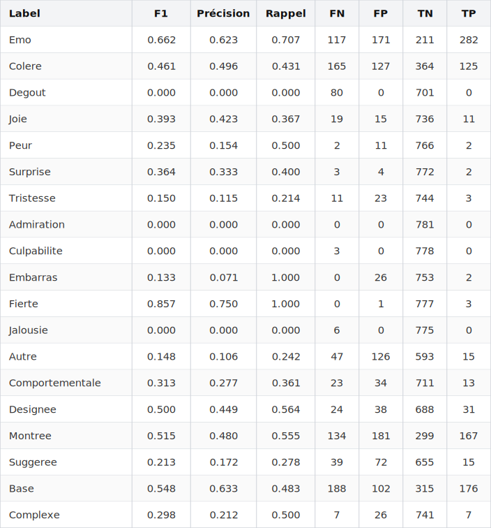
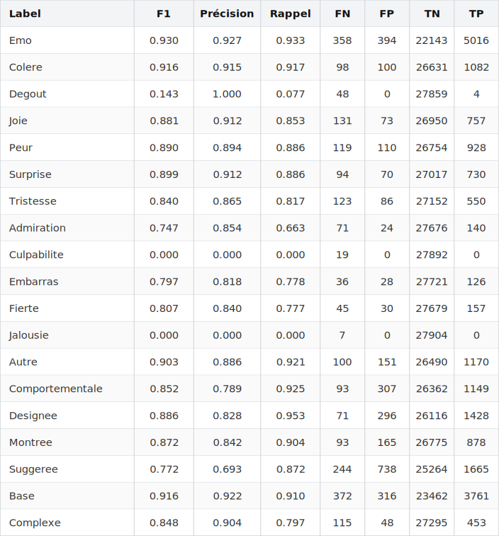
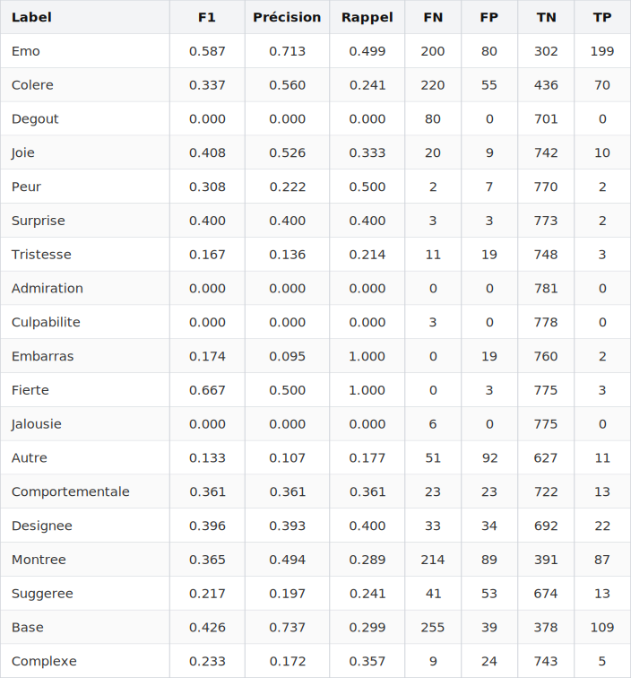

# Évaluation du modèle EMOTYC

Ce dépôt a été conçu pour évaluer les performances du modèle **[EMOTYC](https://huggingface.co/TextToKids/CamemBERT-base-EmoTextToKids)** sur le corpus [CyberAgression-Large](https://github.com/aollagnier/CyberAgression-Large), contenant des messages de cyberharcèlement en français rédigés par des jeunes âgés de 11 à 18 ans.

Le modèle EMOTYC a été conçu par Etienne ([2023](https://bdr.parisnanterre.fr/theses/internet/2023/2023PA100047/2023PA100047.pdf)) dans le cadre du projet [ANR TextToKids](https://texttokids.irisa.fr/publications/)
 

## Installation

```bash
# Créer un environnement virtuel (recommandé)
python -m venv .venv
source .venv/bin/activate

pip install -r requirements.txt
```

**Exemple d'utilisation :**

```bash
python emotyc_predict.py \
    --xlsx ./golds/CyberAdoAgg_gold_global_total.xlsx \
    --out_dir ./results/CyberAggAdo/ContextTemplate \
    --use-context
```
L'option `--use-context` ajoute les phrases adjacentes (i-1 et i+1) lors de l'inférence en formatant l'entrée selon le template BCA (Before, Current, After).

## Cadre théorique et schéma d'annotation utilisé

Le modèle EMOTYC est basé sur CamemBERT et effectue une classification multi-label portant sur 19 labels (la prédiction est de la forme : [ŷ₁, ..., ŷ₁₉] ∈ {0, 1}¹⁹). Ces 19 labels sont organisés en 4 groupes sémantiques : **le Caractère Émotionnel**, **les Émotions**, **les Modes d'Expression** et **le Type**.

<br>
<p align="center">
  
</p>

Les trois labels `Emo`, `Base` et `Complexe` sont déduits des autres labels. Cela s'appuie sur un cadre théorique qui distingue émotions de base et émotions complexes :

<br>
<p align="center">
  
</p>

Ainsi, si une instance est étiquetée `Base = 1` dans le gold, cela peut être interprété comme une disjonction entre toutes les émotions appartenant à l'ensemble des « émotions de base » (cette disjonction étant inclusive, car plusieurs émotions peuvent être activées à la fois sur une même unité textuelle). Cette logique de disjonction est la même pour `Complexe = 1` (avec l'ensemble des émotions complexes) et pour `Emo = 1` (avec tous les labels émotionnels).

Il est possible de mesurer la « cohérence » des prédictions du modèle EMOTYC avec ce cadre théorique (p. ex., il ne devrait pas prédire `Base = 1` si aucune émotion de base n'est activée, ni prédire une émotion complexe — par exemple `Culpabilité = 1` — sans prédire `Complexe = 1`). Cette cohérence n'est pas mesurée ici, mais elle l'est [dans ce script](https://github.com/GwenTsang/EMOTYC/blob/master/scripts/emotyc_sanity_check.py).

Le rapport de recherche qui détaille le schéma d'annotation dans sa version Glozz est détaillé par Etienne et Battistelli ([2021](https://hal.science/hal-03263194v1/document)).


### Génération d'un rapport HTML (`json_summary_to_html.py`)

Convertit le fichier standardisé `emotyc_predictions_summary.json` (généré par les scripts d'inférence) en un rapport HTML lisible, avec possibilité de regrouper les métriques par dimension sémantique.

**Exemple d'utilisation :**
```bash
python json_summary_to_html.py \
    --json ./results/mon_run/emotyc_predictions_summary.json \
    --out ./results/mon_run/rapport.html \
    --groups
```

## Résultats

Le dossier `results/` contient l'ensemble des inférences déjà générées par les scripts d'inférence. Elles sont organisées par corpus évalué et par configuration testée (template, contexte, seuil des modes).

### 1. Corpus évalués

- [TextToKids](`golds/emotexttokids_gold_flat.xlsx`)
- [CyberAggAdo](`golds/CyberAdoAgg_gold_global_total.xlsx`)

Et une version échantillonnée aléatoirement de CyberAggAdo :

- [RandomSample120](`golds/random_sample_120.xlsx`) : 120 lignes

### 2. Configurations testées

Les noms des sous-dossiers indiquent les paramètres passés au script. Par exemple, pour générer le dossier **`ContextTemplateAvecEspaceMode006`** sur le corpus TextToKids, la commande exécutée était :
```bash
python emotyc_predict_details.py \
    --xlsx ./golds/emotexttokids_gold_flat.xlsx \
    --out_dir ./results/TextToKids/ContextTemplateAvecEspaceMode006 \
    --use-context \
    --template bca_spaced \
    --mode-threshold 0.06
```

Les variantes se déclinent selon ces paramètres :
- **Template avec ou sans espace** : `--template bca_spaced` (génère un espace après "current:") ou `--template bca` (sans espace).
- **Avec ou sans contexte** : `--use-context` (ajoute les phrases i-1 et i+1) ou sans cette option (par défaut).
- **Seuil des modes d'expression** : `--mode-threshold 0.06` (seuil très bas pour optimiser le rappel) ou `--mode-threshold 0.5` (seuil classique).

*(Vous trouverez dans chaque sous-dossier le fichier Excel complet, le JSONL détaillé avec les probabilités et les divergences, et le résumé JSON global).*

### Métriques utilisées

La **précision** mesure la fiabilité des prédictions positives :

$$
\text{Precision} = \frac{TP}{TP + FP}
$$

Elle évalue donc, parmi les instances prédites comme positives par le modèle, la proportion réellement correcte. Une baisse de précision sur CyberAggAdo indique une augmentation des **faux positifs** : le modèle attribue à tort un label émotionnel à des instances qui ne le portent pas réellement. Cela suggère que certains indices lexicaux ou contextuels valides dans TTK deviennent ambigus ou trompeurs dans CyberAggAdo.

Le **rappel** mesure la capacité du modèle à retrouver les instances réellement positives :

$$
\text{Recall} = \frac{TP}{TP + FN}
$$

Il porte donc sur l’ensemble des instances dont le label vrai est positif. Une baisse de rappel indique une augmentation des **faux négatifs** : le modèle ne détecte plus certaines occurrences réelles du label. Cela suggère que l’émotion concernée est exprimée dans CyberAggAdo par des formes lexicales, discursives ou contextuelles différentes de celles apprises sur TTK.


L’interprétation des baisses de performance :

* **Baisse de précision, rappel stable** : le modèle détecte encore les vraies occurrences, mais produit davantage de fausses alertes. Il devient moins discriminant dans le nouveau domaine.
* **Baisse de rappel, précision stable** : le modèle reste fiable lorsqu’il prédit le label, mais manque de nombreuses occurrences réelles. Il devient moins sensible aux formes d’expression propres à CyberAggAdo.
* **Baisse conjointe de la précision, du rappel et du F1-score** : le transfert révèle un décalage de domaine. Les indices associés au label dans TTK ne se généralisent pas correctement à CyberAggAdo, ce qui traduit une difficulté du modèle à adapter ses représentations au nouveau corpus.


## Performances

### Performances avec contexte + seuil 0.06

#### Sur CyberAggAdo




#### Sur TextToKids




### Performances avec juste la phrase cible + seuil 0.06

#### Sur CyberAggAdo




#### Sur TextToKids


## Performances relatives : écarts par rapport à TextToKids

Ci-dessous, deux tableaux issus de [`delta_heatmap.py`](delta_heatmap.py). Les résultats correspondent aux écarts signés par label (Δ = TTK − Cyber). Un Δ positif indique une performance supérieure sur TextToKids ; un Δ négatif indique une performance supérieure sur CyberAggAdo.


$$
\Delta = \text{score}_{TTK} - \text{score}_{CyberAggAdo}
$$

Un Δ positif indique une baisse de performance lors du transfert de TextToKids (TTK) vers CyberAggAdo.


### Tableau des performances TTK _vs_ CyberAggAdo sans les phrases adjacentes :


Ce tableau a été obtenu avec

```bash
python delta_heatmap.py \
  --cyber ./results/CyberAggAdo/NoContextTemplateAvecEspace_Rerun/emotyc_predictions_summary.json \
  --ttk ./results/TextToKids/NoContextTemplateAvecEspaceMode006/emotyc_predictions_summary.json \
  --out ./results/heatmap_delta_NoContextTemplateAvecEspaceMode006.html
```

### Tableau des performances TTK _vs_ CyberAggAdo avec les phrases adjacentes :


Ce tableau a été obtenu avec

```bash
python delta_heatmap.py \
  --cyber ./results/CyberAggAdo/ContextTemplateAvecEspaceMode006_Rerun/emotyc_predictions_summary.json \
  --ttk ./results/TextToKids/ContextTemplateAvecEspaceMode006/emotyc_predictions_summary.json \
  --out ./results/heatmap_delta_ContextTemplateAvecEspaceMode006.html
```


## Remarques relatives à la configuration et aux hyperparamètres

Le script [`emotyc_predict.py`](emotyc_predict.py) reprend le template "BCA" (_Before, Current, After_) qui est utilisé lors du fine-tuning du modèle :

```txt
before:{previous_sentence}</s>current: {target_sentence}</s>after:{next_sentence}</s>
```

Lorsque l’option `--use-context` est activée, le script injecte dans le template BCA les phrases immédiatement voisines de la phrase cible : la phrase précédente est placée dans le champ `before`, la phrase courante dans le champ `current`, et la phrase suivante dans le champ `after`. Pour la première et la dernière ligne du fichier, lorsqu’il n’existe pas respectivement de phrase précédente ou suivante, le script remplace le contexte manquant par le token de fin de séquence `</s>`.

L'utilisation de ce template est documentée dans Étienne ([2023](https://theses.hal.science/tel-04210908v1/document), p. 141), dans Étienne et al. (2024, p. 5) (voir l'article sur [ArXiv](https://arxiv.org/pdf/2405.14385) ou sur [ACL](https://aclanthology.org/2024.wassa-1.14.pdf)), ainsi que dans le [README](https://huggingface.co/TextToKids/CamemBERT-base-EmoTextToKids) présent sur le dépôt Hugging Face du modèle. Cela est cohérent avec nos tests, dans lesquels ce template donne les meilleures performances sur le corpus TextToKids.

Par ailleurs, comme dans [l'implémentation officielle d'EMOTYC sur TextToKids](https://gitlab.huma-num.fr/texttokids/ttkwp3-2025/-/blob/main/text_complexity/server/src/processor/semantique/emotyc.py), nous désactivons l'ajout de tokens spéciaux :

```python
add_special_tokens=False
```

Nos tests montrent que les performances d'EMOTYC diminuent quand `add_special_tokens=True`, ce qui suggère que l'ajout de tokens spéciaux était bien désactivé pendant le fine-tuning. Avec `add_special_tokens=False`, le premier token de la séquence n’est pas le token spécial `<s>`, mais le premier token produit par la tokenisation du template BCA, qui correspond au fragment lexical `_be` (car `CamembertTokenizer` ajoute le préfixe `_` lorsqu’un mot est précédé d’un espace). L’état caché associé à ce token en position 0 à la 12e couche du modèle sert de représentation globale utilisée pour la classification.

D'autres tests montrent également que la configuration avec template BCA et `add_special_tokens=True` reste assez performante, bien qu’inférieure à la configuration sans tokens spéciaux. Cela suggère que, dans les deux cas, l'architecture Transformer parvient à diriger l'information pertinente vers la position 0 (qu'il s'agisse du token `_be` lorsque `add_special_tokens=False`, ou du token spécial `<s>` lorsque `add_special_tokens=True`).

### Contiguité et non contiguité

Lance l'inférence de manière séquentielle sur plusieurs fichiers Excel, puis fusionne tous les résultats dans un unique dossier `merged`.

L'objectif principal de cet orchestrateur est de préserver l'intégrité du contexte BCA. Si on produit un XLSX qui résulte d'une concaténation, puis qu'on utilise l'option `--use-context`, une phrase située à la fin d'un fichier XLSX se retrouve injectée comme contexte "before" de la première phrase du fichier XLSX suivant. C'est pourquoi il faut lançer le script d'inférence sur chaque bloc ou fichier individuel. L'échantillonnage contigu doit, par défaut, tirer un bloc de taille 50. Si l'indice de départ est `i` (tiré dans l'intervalle `[0 ; len(xlsx) - 50]`), le bloc sélectionné va de `i` jusqu’à `i + 50` exclu.

Si les phrases sont mélangées ou sélectionnées aléatoirement, il faut être très prudent avec `--use-context`. Le contexte `before`/`after` suivrait alors l’ordre du sous-ensemble et non pas les vraies phrases voisines du document source. La recommandation est donc de ne pas utiliser **`--use-context`** pour tout échantillonnage non contigu.

**Exemple d'utilisation :**
```bash
python orchestrate_emotyc_folder.py \
    --input-dir ./golds \
    --out-dir ./results/orchestrated_run \
    --use-context
```


## Remarques relatives à l'optimisation des scripts d'inférence

Nous utilisons `torch.inference_mode()`, ce qui évite de construire le graphe de gradients. Dans le cas contraire, sans `torch.inference_mode()`, PyTorch peut conserver des informations pour calculer les gradients plus tard : activations, relations entre opérations, métadonnées de vues, compteurs de version, etc. Ce paramètre permet en partie d'économiser de la mémoire et du temps côté autograd. L'implémentation officielle est [disponible ici](https://github.com/pytorch/pytorch/blob/main/torch/autograd/grad_mode.py).

Le modèle a été testé sur CPU et sur différents GPU. Sur Colab, avec une Tesla T4, nous conseillons d'utiliser `--batch-size 900`.
